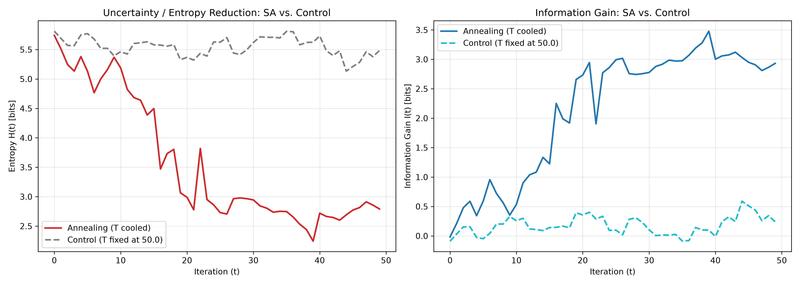

# Information-Theoretic Analysis of TSP Search Dynamics

## Author

**Course:** Applied Information Theory / 応用情報概要  
**Assignment:** Final Project / 最終課題  
**Student ID:** 6807001k  
**Name:** Ryohei Akehi

---

## Overview

This repository investigates the concept of **information** in the context of combinatorial optimization, specifically the Traveling Salesman Problem (TSP).

Information is defined as a reduction in uncertainty, measured using **Shannon entropy**, during a stochastic optimization process. A Simulated Annealing (SA) metaheuristic with a 2-opt neighborhood operator is applied to a population of candidate TSP tours. The entropy of the candidate solution distribution is tracked throughout the search process.

The main purpose of this experiment is not only to observe whether entropy decreases during optimization, but also to investigate **what causes the entropy reduction**. In particular, a control experiment with a fixed temperature is performed to distinguish the effect of the search process from the effect of the SA cooling schedule.

---

## Mathematical Formulation

### 1. Solution Space Probability Distribution

Let

\[
S = \{x_1, x_2, \ldots, x_M\}
\]

be a population of \(M=100\) candidate TSP tours at iteration \(t\), where each tour \(x_i\) has a total length (cost) \(C(x_i)\).

The probability assigned to each tour is modeled using a Boltzmann distribution:

\[
p_i(t)=
\frac{\exp\left(-C(x_i)/T(t)\right)}
{\sum_{j=1}^{M}\exp\left(-C(x_j)/T(t)\right)}
\]

where \(T(t)\) is the temperature at iteration \(t\).

In Simulated Annealing, the temperature is gradually decreased during the search. A high temperature allows the algorithm to explore a wider range of solutions, including some worse solutions, while a lower temperature makes the search increasingly favor lower-cost solutions.

In this experiment, the initial temperature is

\[
T_0=50.0
\]

and the temperature is gradually reduced with the progress of the search.

---

### 2. Shannon Entropy

The uncertainty of the solution distribution is measured using Shannon entropy:

\[
H(t)=-\sum_{i=1}^{M}p_i(t)\log_2p_i(t)
\]

The maximum possible entropy for \(M=100\) equally probable candidates is

\[
H_{\max}=\log_2(100)\approx6.64\text{ bits}
\]

A high entropy indicates that probability is distributed relatively broadly across candidate tours, while a low entropy indicates that probability is concentrated on a smaller number of candidates.

---

### 3. Information Gain

The information gain at iteration \(t\) is defined as the reduction in entropy relative to the initial state:

\[
I(t)=H(0)-H(t)
\]

A positive value indicates that uncertainty has decreased compared with the initial state. A negative value can occur when the entropy temporarily becomes larger than its initial value.

However, because the probability distribution \(p_i(t)\) depends on both the tour costs and the temperature, this quantity should be interpreted carefully. It represents the reduction in uncertainty **under the temperature-dependent Boltzmann model**, rather than a direct measurement of useful information discovered by the search.

---

## Environment & Requirements

### Dependencies

- Python 3.8+
- NumPy
- Matplotlib

### Virtual Environment Setup & Installation

```bash
# Create and activate virtual environment
python -m venv venv
source venv/bin/activate  # On Windows: venv\Scripts\activate

# Install requirements
pip install numpy matplotlib
```

---

## How to Run

Clone or download this repository.

Activate the virtual environment and install the required dependencies.

Then execute the main Python script:

```bash
python main.py
```

The program automatically runs both the normal Simulated Annealing experiment and the fixed-temperature control experiment.

Upon completion, the rendered plot is saved as:

```text
result_information_gain.png
```

---

## Results

The following figure compares the entropy and information gain of the normal Simulated Annealing run and the fixed-temperature control run.



### Annealing Run

The initial entropy was approximately

\[
H(0)\approx5.7\text{ bits}
\]

which is relatively close to the theoretical maximum of approximately 6.64 bits for 100 candidates.

During the 50 iterations, the entropy decreased overall and reached approximately

\[
H(50)\approx2.8\text{ bits}
\]

at the final iteration.

Therefore, the resulting information gain was approximately

\[
I(50)=5.7-2.8\approx2.9\text{ bits}
\]

This indicates that the probability distribution over candidate tours became substantially more concentrated during the annealing process.

### Control Run

To investigate the cause of this entropy reduction, a control experiment was performed with the temperature fixed at

\[
T=50.0
\]

throughout the 50 iterations.

The same 2-opt search process was performed, but the temperature was not decreased.

In contrast to the annealing run, the entropy of the control run remained approximately between 5.1 and 5.8 bits throughout the experiment. Its information gain remained close to zero, although it fluctuated slightly during the search.

This comparison suggests that, under the conditions of this experiment, the 2-opt search process alone did not produce a substantial reduction in entropy when the temperature was kept fixed.

---

## Discussion & Analysis

### 1. Entropy Decreases During Simulated Annealing

The annealing run showed a clear overall decrease in entropy, from approximately 5.7 bits to 2.8 bits.

This means that the probability distribution over candidate tours became increasingly concentrated as the search progressed.

This behavior is consistent with the effect of the Simulated Annealing cooling schedule. As the temperature decreases, differences in tour cost have a stronger effect on the Boltzmann probability distribution. Lower-cost tours therefore receive relatively higher probabilities, causing the probability distribution to become more concentrated and the entropy to decrease.

---

### 2. The Entropy Curve Is Not Monotonic

Although the overall entropy decreased, the curve did not decrease smoothly.

There were several temporary increases in entropy during the search.

This behavior is expected because Simulated Annealing is a stochastic optimization method. The algorithm uses 2-opt operations to modify candidate tours, and worse solutions can sometimes be accepted according to the SA acceptance rule.

Therefore, the distribution of candidate costs can temporarily become more dispersed, causing entropy to increase.

These local increases are not necessarily a sign of failure. They reflect the stochastic nature of the search and the ability of Simulated Annealing to temporarily accept worse solutions in order to avoid becoming trapped in local optima.

---

### 3. Control Experiment: The Effect of Temperature

The control experiment provides an important comparison.

In the normal annealing run, the temperature gradually decreases from the initial value of 50.0. In the control run, the temperature is fixed at 50.0.

The two runs use the same general 2-opt search process, but their entropy behaviors are very different.

The annealing run shows a large decrease:

\[
5.7\rightarrow2.8\text{ bits}
\]

while the control run remains around 5.1–5.8 bits.

This suggests that, under the conditions of this experiment, **the large entropy reduction is strongly associated with the temperature reduction in the annealing schedule**.

In other words, simply performing 2-opt operations did not produce a comparable reduction in entropy when the temperature was fixed.

---

### 4. What Does the 2.9-bit Information Gain Mean?

The annealing run produced an information gain of approximately 2.9 bits according to

\[
I(t)=H(0)-H(t)
\]

At first glance, this might appear to mean that the search algorithm acquired 2.9 bits of information.

However, the control experiment shows why this interpretation is too simple.

The probability distribution is defined as

\[
p_i(t)\propto\exp(-C(x_i)/T(t))
\]

and therefore depends directly on temperature.

When the temperature decreases, the probability distribution becomes more sensitive to differences in tour cost, even independently of improvements caused by the search itself.

Consequently, the observed 2.9-bit reduction should be interpreted as:

> **a reduction in uncertainty under the temperature-dependent Boltzmann model, rather than a direct measurement of the amount of useful information discovered by the TSP search.**

This is an important limitation of using entropy in this particular formulation.

---

### 5. Why Does the Control Run Not Show a Large Entropy Reduction?

In the fixed-temperature control run, the temperature remains at 50.0.

Therefore, the Boltzmann distribution does not become increasingly sharp simply because the temperature decreases.

Although the 2-opt search continues to modify the candidate tours, the entropy remains relatively stable.

This indicates that, in this experiment, the changes in the candidate solution population alone were not sufficient to cause a large reduction in the entropy measured by the proposed Boltzmann model.

This result emphasizes that the measured entropy is affected not only by the quality of the candidate solutions, but also by the temperature parameter used to define their probabilities.

---

### 6. Why Does Entropy Not Reach Zero?

The final entropy of the annealing run is approximately 2.8 bits rather than zero.

Entropy reaches zero only when the probability distribution is completely concentrated on a single candidate.

The population in this experiment does not reach such a state. There are still multiple candidate tours with non-negligible probabilities at the end of the 50 iterations.

This is reasonable given the limited number of iterations and the stochastic nature of Simulated Annealing.

Therefore, a non-zero final entropy does not necessarily indicate that the optimization failed. It indicates that uncertainty about the candidate solutions still remains under the defined probability model.

---

## Connection to Information Theory

This experiment applies the information-theoretic concept of **uncertainty reduction** to a dynamic combinatorial optimization problem.

Shannon entropy provides a quantitative measure of uncertainty in the probability distribution over candidate TSP tours.

The experiment also demonstrates an important point about the interpretation of information measures.

A decrease in entropy does not automatically mean that the optimization algorithm has discovered an equivalent amount of useful information. The definition of the probability distribution itself affects the measured entropy.

In this experiment, the Boltzmann distribution depends on the SA temperature. The control experiment showed that fixing the temperature greatly reduces the observed entropy decrease.

Therefore, the experiment demonstrates both:

1. how Shannon entropy can be used to quantify changes in uncertainty during a TSP search, and
2. why the definition of the probability distribution must be carefully considered when interpreting entropy reduction as information gain.

---

## Conclusion

The experiment demonstrated that the entropy of the candidate-solution distribution decreased substantially during Simulated Annealing, from approximately 5.7 bits to 2.8 bits.

However, the fixed-temperature control experiment showed that this large reduction was not reproduced when the temperature was kept at 50.0.

Therefore, the main finding of this experiment is:

> **The observed entropy reduction in the TSP search was strongly influenced by the temperature-cooling mechanism of Simulated Annealing. The entropy reduction cannot be interpreted directly as information gained through the search process alone.**

This result highlights both the usefulness and the limitation of Shannon entropy as an information measure for stochastic optimization.